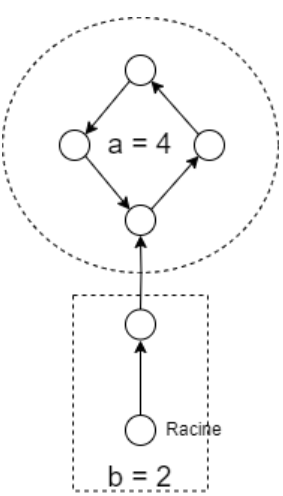

:hardbreaks:
:experimental:
= Problème de la raquette

Une liste chainée de longueur n, comprenant une queue de taille b et une boucle de taille a comme suit :  

Chaque élément contient uniquement un pointeur sur l’élément suivant, un pointeur sur la racine vous est donné. 

Donnez un programme qui permet de déterminer a et b pour n'importe quelle liste (sachant a+b< INT_MAX). 

Contraintes : vous pouvez seulement parcourir la liste chainée, pas la cartographier.
